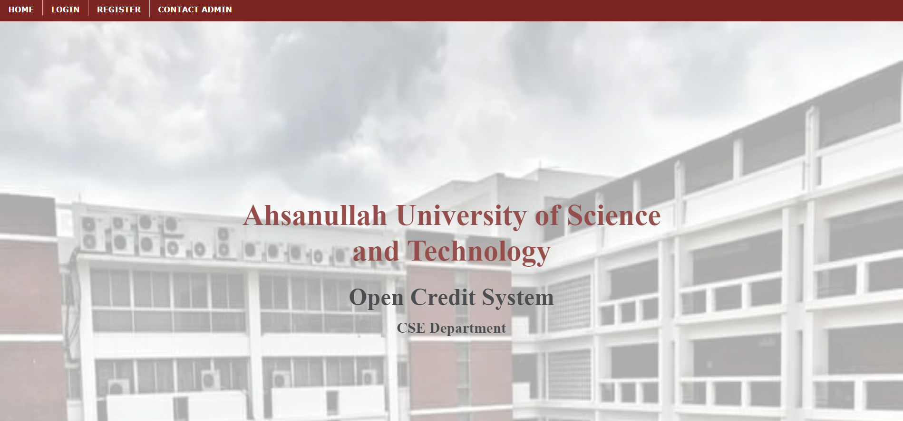
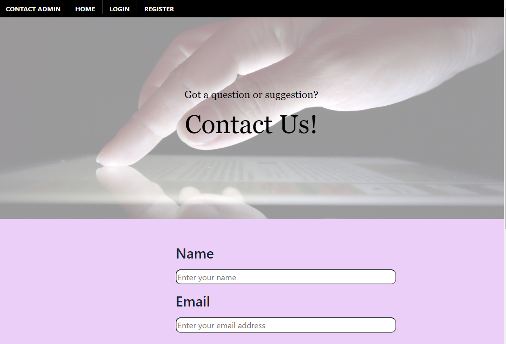
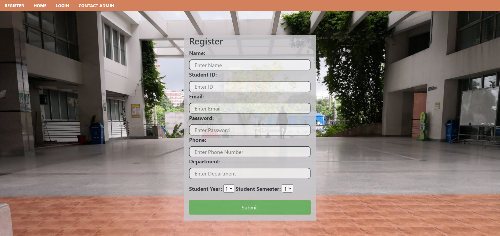

# OpenCreditSystemSD
### 3rd year 1st semester's Software Development
It was a social organizational website where students can pick courses having passed required prerequisites in each semester.
Language: PHP, Database: MySQL

Some of the images of this project are demonstrated below.  

